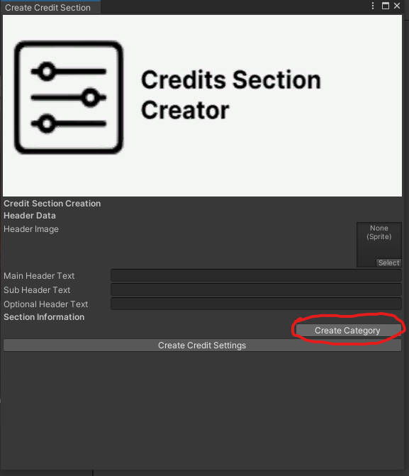
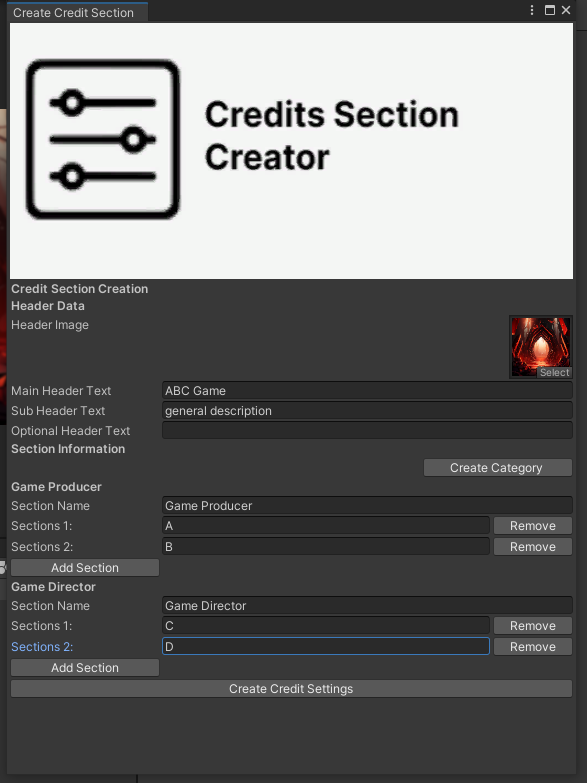
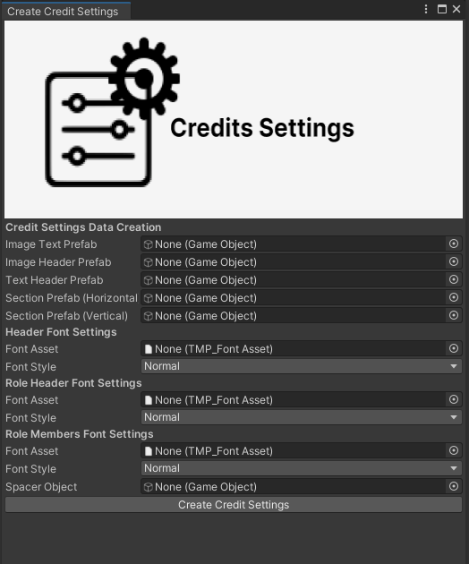

<h1 align="center">Credits System</h1>
<p align="center">
<a href="https://openupm.com/packages/com.studio23.ss2.creditssystem/"></a>
</p>

Credit System is a tool designed for generating and managing data related to player or developer individual components, and sections within a game. It facilitates the creation of comprehensive profiles and progress tracking for a more personalized and engaging user experience.

## Table of Contents

1. [Installation](#installation)
2. [Usage](#usage)
    - [Setting up Credit Sections](#setting-up-credit-sections)
    - [Setting up Credits Settings](#setting-up-credits-settings)
	- [Usage of Credits Controller](#usage-of-credits-controller)
	- [Usage of Scroll View Controller](#usage-of-scroll-view-controller)
3. [License](#license)

## Installation

### Install via Git URL

You can also use the "Install from Git URL" option from Unity Package Manager to install the package.
```
https://github.com/Studio-23-xyz/com.studio23.ss2.creditssystem.git#upm
```

## Usage

### Setting up Credit Sections

This package come with a default scriptable objects which requires to setup necessary credit sections. But If you want to customize and create a new credit sections, just go to Studio 23-> Credit System -> Create Credit Section. Then
fill up the necessary information you required. There is section information where you can create new category and names related to the category.

Final output can be looked like This

Create Credit Settings will create new scriptable object, which you can assign onto credit controller system. 

### Setting up Credit Settings

You can change your own font asset and style in credit settings. To change just go to Studio 23 -> Credit System -> Create Credit Settings.



### Usage of Credits Controller

Credit Controller will generate credit data which you've created from credit section and also generate credit utlities from credit settings asset.

1. **Retreving The Credit Data**:

   Credit Data will be generated from the creditsection asset which you've create and it will generate assets in the hirerchy panel. You just need to press "Generate Credits Data". In CreditController script
   `GenerateSections()` will be responsible for the things. 

2. **Credits Layout Change**:
	
	`GenerateVerticalSelections()`  and `GenerateHorizontalSelections()` will change the credits roll layout elements.
   
 
### Usage of Scroll View Controller

Scrollviewcontroller will change the scrolling speed and positions for the scroll view controller. There is a `scrollDampValue` where you can adjust to control the scroll reset position. 
`OnEndScroll()` will be used whenever the scrolling will be finished.